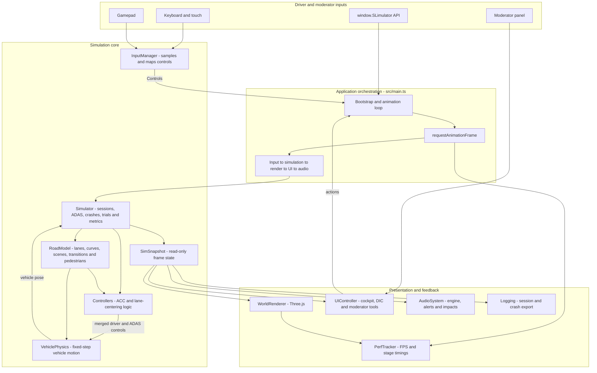

# SLimulator API and Architecture Reference

This document describes the browser API exposed by SLimulator, the state returned by that API, and the internal rendering architecture that turns simulation state into the procedural Three.js world.

The reference matches SLimulator version `6.0.0`.

## Quick start

Open the browser developer console while SLimulator is running. The API is available after the application finishes booting:

```js
const api = window.SLimulator;

api.newSession({ subId: "demo-driver", seed: 12345 });
api.requestScene("l2");
api.setInputSource("external");
api.setDriverControls({ accelerator: 0.6, steer: 0, brake: 0 });

console.log(api.snapshot());
console.log(api.perfSnapshot());
```

The API is intended for testing, automation, moderator tooling, and diagnostics. Application code should treat returned snapshots as read-only values.

## Public browser API

```ts
interface SLimulatorApi {
  version: string;
  renderer: WorldRenderer;

  snapshot(): SimSnapshot;
  perfSnapshot(): PerfSnapshot;
  requestScene(scene: SceneKey, transitionMs?: number): void;
  newSession(options?: { subId?: string; seed?: number }): void;
  setDriverControls(controls: Partial<Controls>): void;
  setInputSource(source: DriverInputSource): void;
  toggleACC(): void;
  toggleLCA(): void;
  triggerAlert(options?: {
    type?: AlertType;
    expectedAction?: ExpectedAction;
    id?: string;
  }): string;
  setPhysicsParam(key: PhysicsParameter, value: number): void;
}
```

### `version`

```ts
window.SLimulator.version: string
```

Returns the running application version.

### `snapshot()`

```ts
snapshot(): SimSnapshot
```

Returns the latest simulation state, including the session, vehicle, road, ADAS state, metrics, crashes, alert trials, and current driver-information-cluster message.

The returned arrays and nested objects are copied from internal state. Treat the entire result as an immutable observation rather than as a way to change the simulator.

```js
const state = window.SLimulator.snapshot();

console.table({
  scene: state.road.scene,
  mode: state.adas.mode,
  speedMph: state.vehicle.speedMph,
  score: state.metrics.totalScore,
  crashes: state.metrics.crashCount
});
```

### `perfSnapshot()`

```ts
perfSnapshot(): PerfSnapshot
```

Returns frame timing, measured pipeline stages, and Three.js renderer statistics.

```js
const perf = window.SLimulator.perfSnapshot();

console.table({
  fps: perf.fps,
  averageFrameMs: perf.frameMs.avg,
  p99FrameMs: perf.frameMs.p99,
  onePercentLowFps: perf.frameMs.onePercentLowFps,
  drawCalls: perf.renderer?.render.calls,
  triangles: perf.renderer?.render.triangles
});
```

Measured stages can include `input`, `sim`, `physics`, `render`, `atmosphere`, `terrain`, `road`, `scenery`, `vehicle`, `camera`, `ui`, and `audio`.

### `requestScene(scene, transitionMs?)`

```ts
type SceneKey = "unmapped" | "l2" | "l3";

requestScene(scene: SceneKey, transitionMs?: number): void
```

Requests a transition to another road environment. The road begins a spatial transition ahead of the vehicle, blending lane geometry and environmental parameters as the vehicle travels through it.

`transitionMs` is currently retained for API compatibility, but the active transition implementation is distance-driven and does not use this value to determine its duration.

```js
window.SLimulator.requestScene("l3");
```

Repeated requests for the active or already-requested scene are ignored.

### `newSession(options?)`

```ts
newSession(options?: {
  subId?: string;
  seed?: number;
}): void
```

Resets simulation state, metrics, crashes, alert trials, ADAS, vehicle position, and the procedural road. The session returns to the `unmapped` scene and remains idle until meaningful driver input or an alert starts it.

- `subId` identifies the subject in snapshots and exported logs.
- `seed` controls deterministic road, terrain, building, vegetation, and scenery placement.
- Omitting `seed` generates one from the current time.

```js
window.SLimulator.newSession({
  subId: "participant-042",
  seed: 8675309
});
```

Use a fixed seed when a test must reproduce the same procedural environment.

Mutable values previously changed with `setPhysicsParam()` are not reset by `newSession()`; reload the page or restore them explicitly when a test requires default physics.

### `setInputSource(source)`

```ts
type DriverInputSource = "local" | "gamepad" | "external";

setInputSource(source: DriverInputSource): void
```

Selects which controls drive the simulation:

| Source | Behavior |
| --- | --- |
| `local` | Keyboard and touch controls sampled by `InputManager`. |
| `gamepad` | Gamepad controls sampled with the current gamepad mapping. |
| `external` | Values supplied through `setDriverControls()`. |

Calling `setDriverControls()` does not take control until the source is set to `external`.

### `setDriverControls(controls)`

```ts
interface Controls {
  steer: number;
  accelerator: number;
  brake: number;
}

setDriverControls(controls: Partial<Controls>): void
```

Updates external driver controls. Omitted properties retain their previous external values.

| Property | Range | Meaning |
| --- | ---: | --- |
| `steer` | `-1` to `1` | Left to right steering input. |
| `accelerator` | `0` to `1` | Accelerator input. |
| `brake` | `0` to `1` | Brake input. |

Values are converted to numbers and clamped to their valid ranges.

```js
const api = window.SLimulator;
api.setInputSource("external");
api.setDriverControls({ accelerator: 0.45 });

// Later: steer while retaining the previous accelerator value.
api.setDriverControls({ steer: -0.2 });

// Stop and release all external controls.
api.setDriverControls({ steer: 0, accelerator: 0, brake: 1 });
```

Applying more than `0.05` brake input disengages ACC and lane-centering assistance.

### `toggleACC()`

```ts
toggleACC(): void
```

Toggles adaptive cruise control.

- Enabling ACC requires a vehicle speed of at least 15 mph.
- The current speed becomes the set speed when ACC engages.
- Disabling ACC also disables active lane centering and clears an armed lane-centering request.
- Driver brake input disengages ACC.

The result is observable through `snapshot().adas` and `snapshot().dicMessage`.

### `toggleLCA()`

```ts
toggleLCA(): void
```

Toggles lane-centering assistance and establishes longitudinal ACC support in the same action.

Behavior depends on the current scene:

| Scene | Result when enabled |
| --- | --- |
| `unmapped` | ACC is enabled and lane centering is armed until a supported highway scene becomes active. |
| `l2` | ACC and L2 lane centering become active. |
| `l3` | ACC and L3 lane centering become active. |

When an armed request completes a transition into `l2` or `l3`, lane centering activates automatically. Transitioning back to `unmapped` disables active lane centering.

### `triggerAlert(options?)`

```ts
type AlertType = "earcon" | "haptic";
type ExpectedAction =
  | "brake"
  | "accelerate"
  | "steerLeft"
  | "steerRight"
  | "acc"
  | "lca";

triggerAlert(options?: {
  type?: AlertType;
  expectedAction?: ExpectedAction;
  id?: string;
}): string
```

Starts an alert-response trial and returns its ID.

- Default type: `earcon`
- Default expected action: `brake`
- Default ID: `trial-N`
- Starting another alert supersedes the currently active trial.
- The alert starts the session if it is still idle.

```js
const trialId = window.SLimulator.triggerAlert({
  type: "earcon",
  expectedAction: "brake",
  id: "hazard-01"
});

console.log(trialId);
```

`pdt` records the first detected control response. `drt` records the first response matching the expected action. Trial state is available in `snapshot().trials`.

The current response detector recognizes `brake`, `accelerate`, `steerLeft`, and `steerRight` from analog control changes. Although `acc` and `lca` are valid trial values, button toggles do not currently complete those expected actions automatically.

### `setPhysicsParam(key, value)`

```ts
type PhysicsParameter =
  | "engineAccel"
  | "aeroDrag"
  | "brakeDecel"
  | "steerResponse"
  | "headingDamping";

setPhysicsParam(key: PhysicsParameter, value: number): void
```

Changes a mutable vehicle-physics parameter immediately.

| Key | Default | Meaning |
| --- | ---: | --- |
| `engineAccel` | `4.5` | Maximum engine acceleration contribution. |
| `aeroDrag` | `0.0023` | Speed-squared aerodynamic drag coefficient. |
| `brakeDecel` | `12.5` | Maximum brake deceleration. |
| `steerResponse` | `0.15` | Per-step steering interpolation response. |
| `headingDamping` | `0.34` | Passive heading-error damping. |

The method currently performs no range validation. Unknown keys are ignored. Test scripts should restore modified parameters or start from a fresh page before comparing runs.

### `renderer`

```ts
renderer: WorldRenderer
```

Exposes the active renderer instance for diagnostics. It includes the Three.js renderer, scene, camera, camera/quality setters, and renderer statistics.

This is a lower-level integration surface than the other API methods. Its internal systems are not declared as a stable public contract, so automation should prefer `snapshot()` and `perfSnapshot()` whenever possible.

## Snapshot schema

```ts
interface SimSnapshot {
  version: string;
  session: SessionState & { seed: number };
  inputSource: "local" | "gamepad" | "external";

  vehicle: {
    speedMps: number;
    speedMph: number;
    roadPositionM: number;
    distanceM: number;
    lateralM: number;
    headingErrorRad: number;
    steerAngleRad: number;
    controls: AppliedControls;
    pose: VehiclePose;
    crashReset: CrashState | null;
  };

  road: {
    scene: "unmapped" | "l2" | "l3";
    requestedScene: "unmapped" | "l2" | "l3";
    lanesPerDirection: number;
    transition: RoadTransition | null;
    seed: number;
    bounds: RoadBounds;
    lane: LaneInfo;
    curvePoints?: Array<{ sOffset: number; xOffset: number }>;
  };

  adas: AdasState & {
    mode: "manual" | "acc" | "l2" | "l3";
    setSpeedMph: number;
  };

  metrics: MetricsState & {
    totalScore: number;
    crashPenaltyTotal: number;
  };

  crashes: CrashRecord[];
  trials: AlertTrial[];
  dicMessage: string;
}
```

### Session fields

| Field | Meaning |
| --- | --- |
| `subId` | Optional subject identifier. |
| `started` | Whether meaningful input or an alert has started the session. |
| `status` | `idle` or `running`. |
| `elapsed` | Running session time in seconds. |
| `startedAt` | ISO timestamp, or `null` before the session starts. |
| `seed` | Procedural-generation seed. |

### Vehicle and road coordinates

SLimulator uses road-relative coordinates as its simulation source of truth:

- `s` or `roadPositionM` is distance along the procedural road.
- `lateral` is signed displacement from the road centerline.
- `headingError` is the vehicle heading relative to the local road heading.
- `x`, `y`, and `z` are derived Three.js world coordinates.

`RoadModel.frameAt(s)` supplies the local curve, heading, forward axis, and right axis used to translate road-relative state into world space.

### Road transitions

```ts
interface RoadTransition {
  from: SceneKey;
  to: SceneKey;
  progress: number;
  originS: number;
  taperStartS: number;
  lockS: number;
}
```

Scene properties are blended along the road rather than switched everywhere at once. This allows lane count, road width, scenery density, terrain, and atmosphere to change progressively as the vehicle reaches the transition.

### Metrics

| Field | Meaning |
| --- | --- |
| `steeringPoints` | Points accumulated while driving within road bounds, weighted by lane proximity. |
| `offRoadPenalty` | Time-based penalty accumulated while either tire is outside the road edge. |
| `offRoadSeconds` | Total time outside the road edge. |
| `crashCount` | Recorded wall and pedestrian crashes. |
| `laneChanges` | Lane changes that remain stable for more than 0.55 seconds. |
| `sdlp` | Sample standard deviation of lateral lane position. |
| `timeByMode` | Seconds spent in manual, ACC, L2, and L3 modes. |
| `alertCounts` | Earcon and haptic alert counts. |
| `totalScore` | Steering points minus off-road and crash penalties. |
| `crashPenaltyTotal` | Crash count multiplied by the configured crash penalty. |

## Application architecture



Each animation frame follows one central pipeline:

1. `InputManager` samples driver controls.
2. `Simulator` chooses local or external input and combines it with ADAS behavior.
3. `VehiclePhysics` advances the vehicle at a fixed 60 Hz against `RoadModel` geometry.
4. `Simulator` produces an interpolated `SimSnapshot` for the display frame.
5. Rendering, cockpit UI, audio, logging, and diagnostics consume the snapshot without owning simulation state.

## WorldRenderer module

`WorldRenderer` orchestrates the render pipeline. Procedural generation is distributed across `RoadModel`, `RoadRibbonSystem`, `TerrainSystem`, `ScenerySystem`, and `AtmosphereSystem`.

```mermaid
flowchart TB
    World[WorldRenderer - src/render/WorldRenderer.ts]
    Snapshot[SimSnapshot - vehicle pose, scene and transition]
    Road[RoadModel - seed and procedural road coordinates]
    Physics[VehiclePhysics - chassis and wheel transforms]
    Quality[Render quality - high or perf]
    Clock[Animation time]

    Snapshot --> World
    Road --> World
    Physics --> World
    Quality --> World
    Clock --> World

    subgraph Scene[Three.js Scene]
        Atmosphere[AtmosphereSystem]
        Terrain[TerrainSystem]
        Ribbons[RoadRibbonSystem]
        Scenery[ScenerySystem]
        Vehicle[VehicleVisual]
        Camera[Camera controller]
        Lights[Ambient, hemisphere and directional lights]
    end

    World --> Atmosphere
    World --> Terrain
    World --> Ribbons
    World --> Scenery
    World --> Vehicle
    World --> Camera
    World --> Lights

    Atmosphere --> Sky[Sky dome or fallback sky]
    Atmosphere --> Clouds[Instanced procedural clouds]
    Atmosphere --> Mountains[Mountain ridges]
    Atmosphere --> Fog[Scene fog and exposure]

    Terrain --> Tiles[Rolling terrain tiles]
    Terrain --> Noise[Seeded multi-scale height noise]
    Terrain --> Cover[Instanced near and far ground cover]

    Ribbons --> RoadSurface[Road and shoulders]
    Ribbons --> Verges[Ground, verges and walls]
    Ribbons --> Markings[Edge, center and lane markings]
    Ribbons --> Rails[Guardrail faces and lines]

    Scenery --> Vegetation[Trees and roadside brush]
    Scenery --> Buildings[Buildings, shops, stores and skyscrapers]
    Scenery --> Furniture[Posts, reflectors, utility poles and streetlights]
    Scenery --> Crosswalks[Crosswalks, signals and pedestrians]
    Scenery --> Signs[Speed and transition signs]

    Vehicle --> Car[Car meshes and wheels]
    Vehicle --> VehicleFX[Headlights and light trails]
    Camera --> Modes[Cockpit, chase or debug]
```



### Per-frame render order

```ts
atmosphere.update(snapshot, timeSeconds);
terrain.update(snapshot);
roadRibbons.update(snapshot);
scenery.update(snapshot, timeSeconds);
vehicleVisual.update(snapshot, timeSeconds);
updateCamera(snapshot, now);
renderer.render(scene, camera);
```

Each stage is independently measured by `PerfTracker` when a performance recorder is supplied.

## Procedural world-generation pipeline

```mermaid
flowchart TB
    Begin[WorldRenderer.render snapshot and time]

    subgraph Source[Shared procedural source]
        Seed[Session road seed]
        Position[Vehicle road position s]
        Scene[Scene parameters - lanes, city, forest, buildings and curvature]
        Transition[Scene-transition interpolation]
        Hash[Deterministic hash01]
        Coordinates[RoadModel - frameAt, boundsAt and worldFromRoad]
    end

    Seed --> Hash
    Scene --> Coordinates
    Transition --> Coordinates
    Position --> Coordinates

    subgraph RoadGeneration[RoadRibbonSystem]
        RoadWindow[Snap sample windows around vehicle]
        SampleRoad[Sample road frames and bounds]
        WriteRibbons[Rewrite dynamic vertex buffers]
        RoadProducts[Ground, road, shoulders, verges and walls]
        WriteLines[Generate guardrails and road markings]
        LaneReveal[Reveal dividers as lane count transitions]
    end

    Begin --> RoadWindow
    Coordinates --> SampleRoad
    RoadWindow --> SampleRoad
    SampleRoad --> WriteRibbons --> RoadProducts
    SampleRoad --> WriteLines
    Scene --> LaneReveal --> WriteLines

    subgraph TerrainGeneration[TerrainSystem - high quality]
        TileWindow[Select 36 m tiles - 2 behind and 15 ahead on both sides]
        Profiles[Derive forest, urban, relief, width and color profile]
        Queue[Queue missing or stale tiles]
        Budget[Build at most two tiles per frame]
        Heights[Combine broad, medium and fine seeded noise]
        Mesh[Update positions, colors, UVs and normals]
        Pool[Recycle tiles leaving the window]
        GroundCover[Instance deterministic near and far cover]
    end

    Begin --> TileWindow
    Position --> TileWindow
    Scene --> Profiles
    TileWindow --> Profiles --> Queue --> Budget
    Hash --> Heights
    Coordinates --> Heights
    Budget --> Heights --> Mesh --> GroundCover
    TileWindow --> Pool
    Hash --> GroundCover

    subgraph SceneryGeneration[ScenerySystem]
        AnchorWindow[Divide visible road into 18 m anchors]
        SceneValues[Read interpolated scene density at each anchor]
        Rolls[Combine seed, anchor and side into stable random rolls]
        Slots[Calculate roadside slots, clearance and setbacks]
        Select[Choose object type, scale, color, rotation and offset]
        Dynamic[Animate pedestrians and other time-dependent elements]
        Instances[Write InstancedMesh transforms and hide unused instances]
    end

    Begin --> AnchorWindow
    Position --> AnchorWindow
    Scene --> SceneValues
    Transition --> SceneValues
    AnchorWindow --> Rolls
    Hash --> Rolls
    Rolls --> Slots
    Coordinates --> Slots
    SceneValues --> Select
    Slots --> Select --> Instances
    Begin --> Dynamic --> Instances

    subgraph AtmosphereGeneration[AtmosphereSystem]
        Biome[Read forest and urban values]
        FogLogic[Blend fog color, range and exposure]
        CloudBases[Use deterministic cloud bases and puff layouts]
        CloudMotion[Move cloud field relative to vehicle and time]
        Horizon[Reposition sky, mountains and fog band around driver]
    end

    Begin --> Biome
    Scene --> Biome --> FogLogic
    Hash --> CloudBases --> CloudMotion
    Position --> CloudMotion
    Coordinates --> Horizon

    RoadProducts --> Draw[WebGLRenderer renders the scene]
    WriteLines --> Draw
    Mesh --> Draw
    GroundCover --> Draw
    Instances --> Draw
    FogLogic --> Draw
    CloudMotion --> Draw
    Horizon --> Draw
```



### Determinism and streaming

The procedural world is generated as a rolling, deterministic window:

1. Vehicle distance `s` is the primary spatial coordinate.
2. The session seed plus tile, anchor, scene, and side identifiers produce stable random values.
3. Only geometry surrounding and ahead of the vehicle remains active.
4. Road surfaces rewrite reusable buffers instead of creating a new scene graph every frame.
5. Scenery reuses `InstancedMesh` pools for repeated objects.
6. High-quality terrain queues work and builds at most two tiles per frame to avoid a large frame spike.
7. Terrain tiles leaving the active window are pooled and reused.
8. Scene transitions interpolate road and environment properties along distance, rather than replacing the world abruptly.

### Quality modes

Both modes use the same simulation state and road-coordinate system.

| Area | `high` | `perf` |
| --- | --- | --- |
| Road sampling | 160 road samples and 432 guardrail samples | 96 road samples and 224 guardrail samples |
| Scenery range | Approximately 50 m behind and 420 m ahead | Approximately 36 m behind and 260 m ahead |
| Scenery density | Full density | Reduced density |
| Scenery update rate | 8 time buckets per second | 4 time buckets per second |
| Terrain tiles | Procedural tiled terrain enabled | High-detail tiled terrain hidden |
| Sky | Shader sky dome | Simpler fallback sky |
| Clouds | Full instanced cloud set | Reduced cloud set |
| Pixel ratio | Clamped high-resolution ratio | `1` |

## Automation examples

### Reproducible external-driving session

```js
const api = window.SLimulator;

api.newSession({ subId: "automated-run", seed: 20260713 });
api.setInputSource("external");
api.setDriverControls({ accelerator: 0.7, brake: 0, steer: 0 });

const interval = setInterval(() => {
  const state = api.snapshot();
  console.log(state.vehicle.speedMph, state.vehicle.roadPositionM);

  if (state.vehicle.speedMph >= 30) {
    api.setDriverControls({ accelerator: 0.15 });
    clearInterval(interval);
  }
}, 250);
```

### Wait for a scene transition

```js
async function waitForScene(scene) {
  while (window.SLimulator.snapshot().road.scene !== scene) {
    await new Promise((resolve) => setTimeout(resolve, 100));
  }
}

window.SLimulator.requestScene("l2");
await waitForScene("l2");
console.log("L2 scene active");
```

The vehicle must travel through the distance-based transition for the requested scene to become active.

### Capture a completed alert trial

```js
const api = window.SLimulator;
api.setInputSource("external");

const id = api.triggerAlert({
  type: "earcon",
  expectedAction: "brake"
});

api.setDriverControls({ brake: 0.8 });

const trial = api.snapshot().trials.find((item) => item.id === id);
console.log(trial);
```

## Source map

| Concern | Source |
| --- | --- |
| Browser API registration and frame loop | `src/main.ts` |
| Browser API declaration | `src/global.d.ts` |
| Public state types | `src/game/types.ts` |
| Simulation state and API behavior | `src/game/simulator.ts` |
| ADAS control merging | `src/game/controllers.ts` |
| Scene definitions and constants | `src/game/config.ts` |
| Procedural route coordinates | `src/game/route.ts` |
| Vehicle physics and mutable parameters | `src/physics/vehiclePhysics.ts` |
| Renderer orchestration | `src/render/WorldRenderer.ts` |
| Procedural road meshes | `src/render/roadRibbons.ts` |
| Procedural terrain tiles | `src/render/terrainSystem.ts` |
| Procedural scenery placement | `src/render/scenerySystem.ts` and `src/render/scenerySlots.ts` |
| Sky, clouds, mountains, and fog | `src/render/atmosphere.ts` |
| Vehicle rendering | `src/render/vehicleVisual.ts` and `src/render/vehicleLights.ts` |
| Performance snapshot | `src/diagnostics/perf.ts` |
| Log export | `src/game/logging.ts` |
